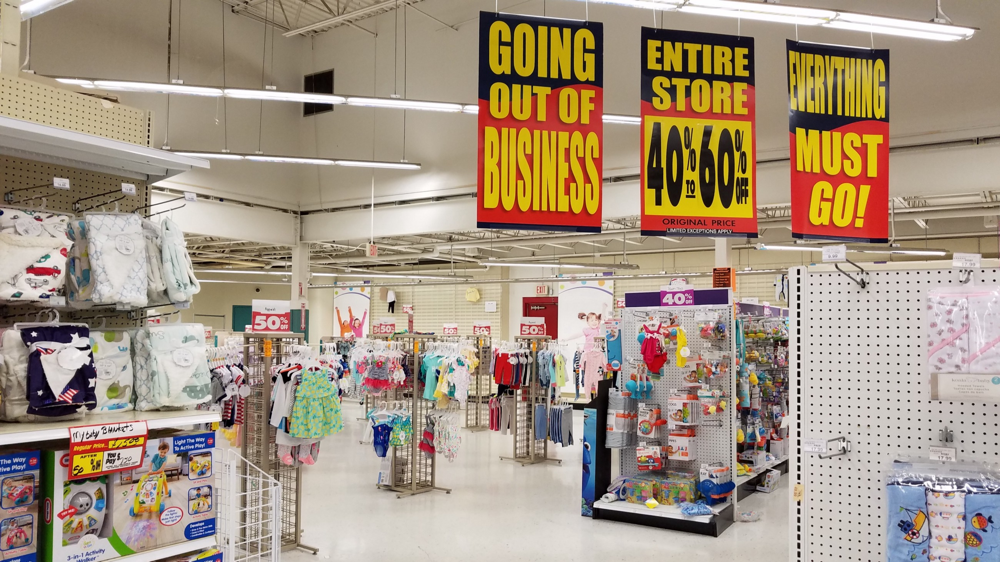

# Retail Apocalypse in 2019

If you are planning on opening a physical store for selling consumer goods, you probably need to give it another thought. With the digitization and online shopping available at our fingertips, the option of going to the store looks way more time-consuming and inconvenient. You might ask, if this is so, how is Costco flourishing with a billion dollar profit? I have an answer to this — look at Costco’s business model. It does not try to confuse you with an array of options in different categories. Rather, it does the work of qualitative filtering and you just need to go and pick the available item in that category trusting that it’s the most reasonable choice in a decent price range making you proud of your membership purchase here. In these times, it’s actually a much better idea to start your retail sales business online like none other than the market leader Amazon with a net profit of around 5 billion dollar (approximately 5 times more than Costco) in 2019 accounting only for its global online sales excluding AWS. Also, note here that Amazon is not just an online retail, it’s a platform for enabling sales. It has very few proprietary products under its hood, most of the products sold are just facilitated to be sold on this platform . Amazon’ s online business is majorly focused around service. However, retail market is already very tight and the majority of retail investors have been suffering with negligible margins since 2010.

In this article, I have analyzed the data for all store closures in 2019. One of these, Lord & Taylor started as early as 1826 . The motive behind this is to get an insights into the future of the retail market by exploring the 2019 retail stores closure dataset. I created this data from the following article (https://moneywise.com/a/retailers-closing-stores-in-2019).

This goes without mention that clothing sector is witnessing the highest shutdown in the recent times. The primary reason is equal and easy availability online with all tools to estimate which piece of clothing would be your best fit/match. As an example, pregnant women would go shopping for maternity clothes in the past but with life getting so fast, they hardly have time for that in most cases. It’s preferable to go online rather. Secondly, I would say with ever changing fashion trends, consumers end up buying a lot of unnecessary apparels and accessories. And few clothes are appropriate/acceptable enough to be worn just once, like clothes for special occasions ,trips, family events etc. This is leading to the wave of rental clothing industry like Rent the Runway, Le Tote, Swap.com etc. People rent designer apparels and accessories, wear them a few times and then move on to next designs/brands. Finally, the clothing space is overcrowded. In business, sometimes we forget to realize when the lane has become too narrow to pass and as a result, all businesses suffer and competition starts chasing the sky. Eventually, these stores are forced to shut down at the verge of becoming bankrupt or by declaring bankruptcy.

Even for the second highest category seeing closures — the department stores, there is a similar story. With so many department stores in this online world, it hardly makes sense to physically go and buy stuff at the same price you get online and don’t forget the easy return policies. Additionally, online shopping makes it much easier for the data analysts and scientists to understand consumer buying patterns, inventory management and product recommendation stepping up the online sale in the ladder.
But, if you still believe in physical retail stores, it is a much safer bet to offer personalized services like Zara and somewhat Costco amongst few others. Remember how few decades back, we used to go to tailor shops for our clothes to be stitched, custom jewelry shops for getting a pair of earrings, rings etc.. Today, on the contrary, if you head to a fashion retail store in general, it’s easy to get confused with so many options and wasting much more time than actually needed. On a funny note, not only the earth is round, but the consumer consumption pattern is cyclic as well with the exception of doing the same old thing with technological advancements. For example, a humble tailor store becomes a personalized designer store; barber shops turn into fancy salons but the essence at the core is still the same. Following chart shows the specific number of each store closure in 2019.

Once we transitioned to machine age, likewise this is the information age fuelled by exponentially growing data volumes at hyper velocities. So, the big thing to understand today is that just opening physical stores across the globe won’t help much. Instead focus on enabling the sellers and consumers in the most strategic way to eventually see the win yourself.
